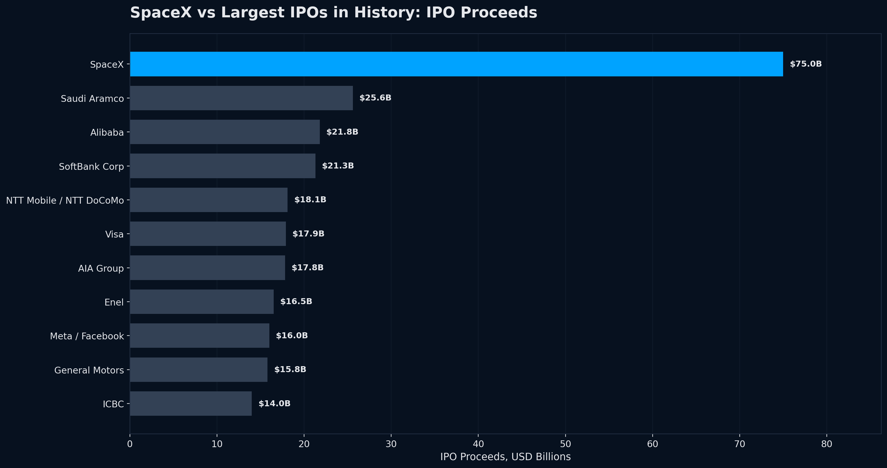
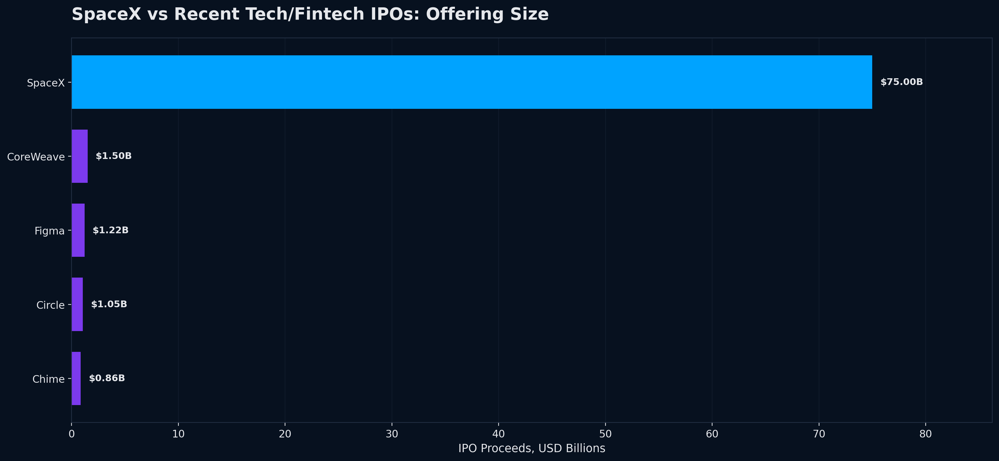
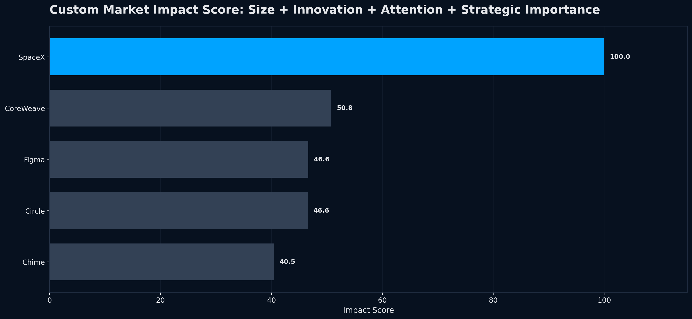
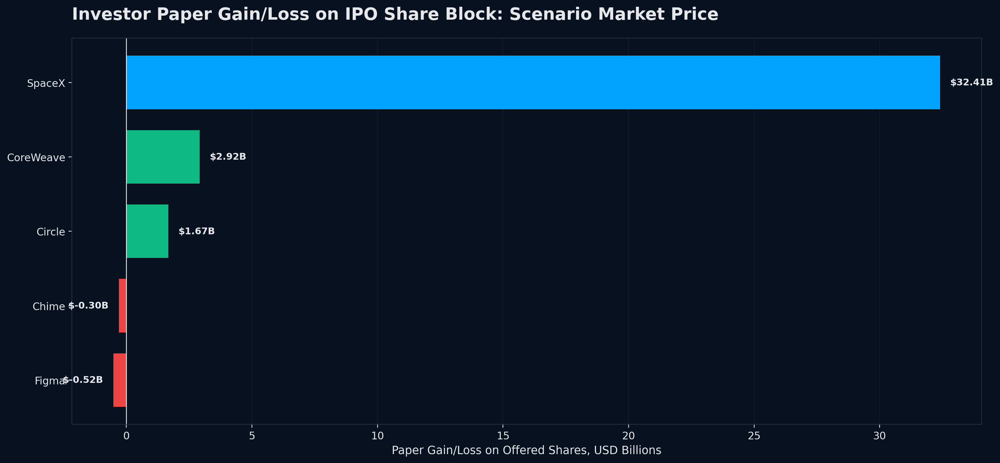
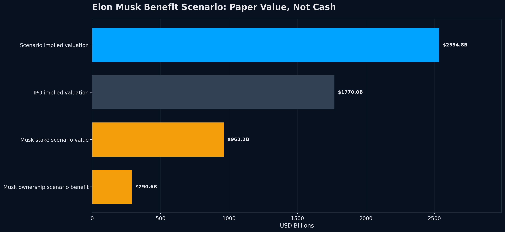

# SpaceX IPO Market Impact Analysis

A professional business analytics portfolio project analyzing SpaceX's IPO impact through historical IPO comparisons, recent tech/fintech peer comparisons, investor paper-gain scenarios, and Elon Musk ownership-benefit scenarios.

## Project Highlights

- SpaceX IPO proceeds: **$75.00B**
- SpaceX vs previous historical IPO record: **2.93x larger**
- SpaceX vs median recent IPO peer: **66.0x larger**
- Scenario implied SpaceX market cap: **$2,534.77B**
- Musk scenario paper gain: **$290.61B**

## Business Question

How different is the SpaceX IPO compared with recent IPOs and the largest IPOs in history, and how much market impact can it create for investors, Elon Musk, and the broader stock market?

## What Makes SpaceX Different?

SpaceX is not a normal single-sector IPO. It combines:

- Reusable rocket technology
- Starlink satellite internet
- Aerospace and defense infrastructure
- Government contracts
- AI infrastructure narrative
- Global brand power
- Retail investor attention
- Future liquidity, ETF, and index-demand potential

## Repository Structure

```text
spacex_ipo_market_impact_github/
|-- data/
|   |-- recent_ipos.csv
|   |-- historical_ipos.csv
|   |-- scenario_prices.csv
|   |-- musk_assumptions.csv
|-- src/
|   |-- spacex_ipo_market_impact.py
|-- outputs/
|   |-- figures/
|   |-- tables/
|-- reports/
|   |-- SpaceX_IPO_Executive_Report.html
|-- docs/
|   |-- linkedin_post.md
|   |-- project_summary.md
|-- requirements.txt
|-- README.md
```

## Tools Used

- Python
- pandas
- NumPy
- Matplotlib
- Plotly
- Excel output using openpyxl

## How to Run

```bash
pip install -r requirements.txt
python src/spacex_ipo_market_impact.py
```

Then open:

```text
reports/SpaceX_IPO_Executive_Report.html
```

## Main Outputs

### SpaceX vs Largest IPOs



### SpaceX vs Recent IPOs



### Market Impact Score



### Investor Paper Gain Scenario



### Elon Musk Benefit Scenario



## Data Notes

- SpaceX IPO share count and IPO price are based on official IPO pricing data.
- Historical IPO proceeds are approximate and can vary depending on whether over-allotment/greenshoe options are included.
- Investor and Musk benefit numbers are scenario-based paper-value estimates, not realized cash profits.
- This project is not investment advice.

## Author

**Kiran Kanth Madigani**  
Business Analytics | Data Analytics | SQL | Python | Tableau | Power BI | Financial Analytics

